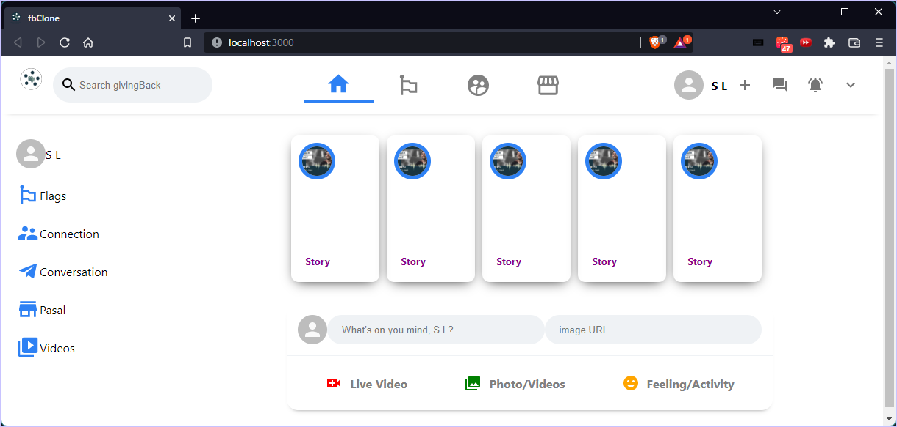

# Facebook Web App Clone Created with React.js and Firebase
<p align="center">
<h2> Demo </h2>
</img>
</p>

## Welcome 
Thanks for checking out [fbclone](https://github.com/sanjiblamichhane/fbclone) project.

## Requirements:
- Create a Front-end for Facebook Clone using React
- Deploy the solution to Firebase


## Solution
### React.js FrontEnd
- A webapp is created based on react.js froms scratch
- utilized essential concepts such as JSX, class and function components, props, state, lifecycle methods, and hooks

## Run this Project
1. First, Clone the repository locally.
```
git clone git@github.com:sanjiblamichhane/fbclone.git
```
2. ```cd``` into the cloned repository and type
```
npm install
```
3. Run the React Project
```
npm start
```
